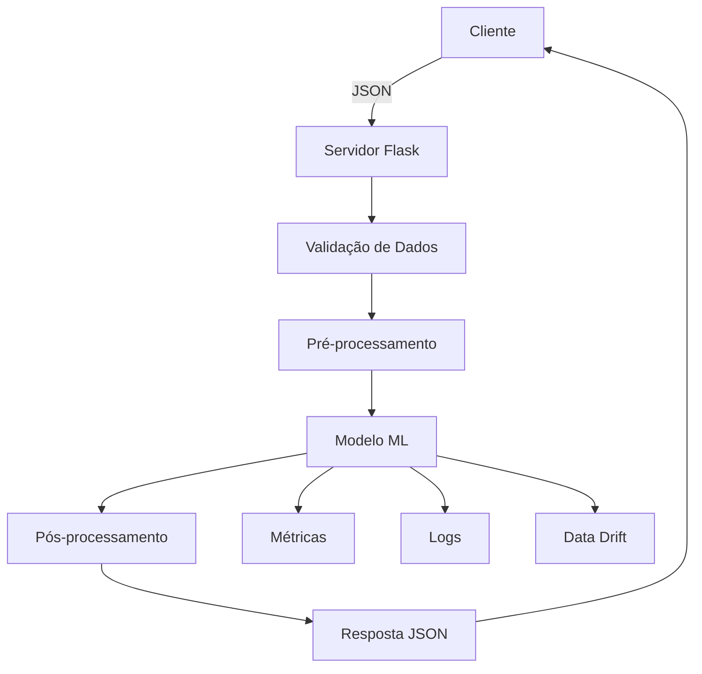

# 🎯 API de Classificação de Score de Crédito

Uma API robusta e inteligente que classifica automaticamente o score de crédito de clientes em três categorias (**Good**, **Standard**, **Poor**) baseada em características financeiras e comportamentais.

## 🌟 Visão Geral

Esta API utiliza **Machine Learning** para analisar o perfil financeiro de um cliente e determinar seu score de crédito com alta precisão. O sistema foi desenvolvido com **MLflow** para versionamento de modelos, **Flask** para servidor web, e **pytest** para testes robustos.

### 🎯 O que a API Faz

- **📊 Análise Inteligente**: Processa 23+ variáveis financeiras do cliente
- **🎯 Classificação Precisa**: Retorna score em 3 categorias com probabilidades
- **🔄 Auto-Preenchimento**: Preenche campos faltantes com valores inteligentes
- **🛡️ Validação Robusta**: Valida e sanitiza todos os dados de entrada
- **📈 Monitoramento**: Coleta métricas para análise de drift de dados
- **🔧 Múltiplos Formatos**: Suporta invocação direta e via API Gateway

## 🚀 Quick Start

### 1. **Instalação**

```bash
# Clonar repositório
git clone <repo-url>
cd api

# Instalar dependências
pip install -r requirements.txt

# Baixar modelo do MLflow (opcional)
python model_downloader.py
```

### 2. **Subir API como Servidor Web**

```bash
# Opção 1: Servidor Flask (Recomendado)
python server.py
```

**🌐 API disponível em: http://localhost:5000**

```bash
# Opção 2: Forçar uso do MLflow
python run_api_with_mlflow.py
```

### 3. **Testar Funcionamento**

```bash
# Executar todos os testes
python -m pytest tests/ -v

# Demonstração completa
python demo_api.py
```

## 🌐 Endpoints da API

### **🏠 Health Check**
```http
GET http://localhost:5000/
```

**Resposta:**
```json
{
  "status": "healthy",
  "service": "Credit Score API",
  "model": "fiap-mlops-score-model",
  "version": "1.0",
  "source": "mlflow_registry"
}
```

### **🎯 Predição de Score (Principal)**
```http
POST http://localhost:5000/predict
Content-Type: application/json
```

**Payload:**
```json
{
  "data": {
    "Age": 35,
    "Annual_Income": 65000,
    "Monthly_Inhand_Salary": 5200,
    "Num_Bank_Accounts": 2,
    "Num_Credit_Card": 2,
    "Interest_Rate": 11.5,
    "Num_of_Loan": 1,
    "Outstanding_Debt": 8000,
    "Credit_Utilization_Ratio": 28.5,
    "Total_EMI_per_month": 950,
    "Amount_invested_monthly": 800,
    "Monthly_Balance": 3200,
    "Occupation": "Software Engineer",
    "Credit_Mix": "Good",
    "Payment_of_Min_Amount": "No",
    "Payment_Behaviour": "Low_spent_Medium_value_payments"
  }
}
```

**Resposta:**
```json
{
  "prediction": "Good",
  "confidence": 0.85,
  "probabilities": {
    "Good": 0.85,
    "Standard": 0.12,
    "Poor": 0.03
  },
  "model_version": "1.0",
  "model_name": "fiap-mlops-score-model",
  "timestamp": "2025-01-15T10:30:00.123456"
}
```

### **📋 Informações do Endpoint**
```http
GET http://localhost:5000/predict
```

### **🔍 Informações do Modelo**
```http
GET http://localhost:5000/model-info
```

## 📊 Campos de Entrada

### **Campos Obrigatórios** (Numéricos)

| Campo | Tipo | Descrição | Exemplo | Faixa |
|-------|------|-----------|---------|-------|
| `Age` | float | Idade do cliente | 35 | 18-100 |
| `Annual_Income` | float | Renda anual (USD) | 65000 | ≥ 0 |
| `Monthly_Inhand_Salary` | float | Salário líquido mensal | 5200 | ≥ 0 |
| `Num_Bank_Accounts` | int | Número de contas bancárias | 2 | ≥ 0 |
| `Num_Credit_Card` | int | Número de cartões de crédito | 2 | ≥ 0 |
| `Interest_Rate` | float | Taxa de juros (%) | 11.5 | ≥ 0 |
| `Num_of_Loan` | int | Número de empréstimos | 1 | ≥ 0 |
| `Outstanding_Debt` | float | Dívida pendente (USD) | 8000 | ≥ 0 |
| `Credit_Utilization_Ratio` | float | Taxa de utilização de crédito (%) | 28.5 | 0-100 |
| `Total_EMI_per_month` | float | Total de EMIs mensais | 950 | ≥ 0 |
| `Amount_invested_monthly` | float | Valor investido mensalmente | 800 | ≥ 0 |
| `Monthly_Balance` | float | Saldo mensal médio | 3200 | ≥ 0 |

### **Campos Opcionais** (Categóricos)

| Campo | Tipo | Valores Aceitos | Padrão |
|-------|------|-----------------|--------|
| `Occupation` | string | Qualquer profissão | "Other" |
| `Credit_Mix` | string | Good, Standard, Poor, Excellent | "Standard" |
| `Payment_of_Min_Amount` | string | Yes, No | "No" |
| `Payment_Behaviour` | string | Padrões de comportamento de pagamento | "Low_spent_Medium_value_payments" |

### **Campos Auto-Preenchidos** (Se não fornecidos)

| Campo | Valor Padrão | Descrição |
|-------|--------------|-----------|
| `Delay_from_due_date` | 0 | Atraso em dias |
| `Num_of_Delayed_Payment` | 0 | Número de pagamentos atrasados |
| `Changed_Credit_Limit` | 0 | Mudanças no limite de crédito |
| `Num_Credit_Inquiries` | 0 | Consultas de crédito |
| `Month` | "January" | Mês da análise |
| `Type_of_Loan` | "Personal Loan" | Tipo de empréstimo |
| `Credit_History_Age` | "5 Years" | Idade do histórico de crédito |

## 🧪 Exemplos de Uso

### **🔥 Exemplo com curl**

```bash
# Usando dados do arquivo data.json
curl -X POST http://localhost:5000/predict \
  -H "Content-Type: application/json" \
  -d @data.json

# Exemplo direto
curl -X POST http://localhost:5000/predict \
  -H "Content-Type: application/json" \
  -d '{
    "data": {
      "Age": 30,
      "Annual_Income": 50000,
      "Monthly_Inhand_Salary": 4000,
      "Num_Bank_Accounts": 2,
      "Num_Credit_Card": 1,
      "Interest_Rate": 12.0,
      "Num_of_Loan": 1,
      "Outstanding_Debt": 5000,
      "Credit_Utilization_Ratio": 30.0,
      "Total_EMI_per_month": 500,
      "Amount_invested_monthly": 300,
      "Monthly_Balance": 2000
    }
  }'
```

### **🐍 Exemplo com Python**

```python
import requests
import json

# Dados do cliente
client_data = {
    "data": {
        "Age": 42,
        "Annual_Income": 80000,
        "Monthly_Inhand_Salary": 6500,
        "Num_Bank_Accounts": 3,
        "Num_Credit_Card": 2,
        "Interest_Rate": 8.5,
        "Num_of_Loan": 1,
        "Outstanding_Debt": 5000,
        "Credit_Utilization_Ratio": 20.0,
        "Total_EMI_per_month": 1200,
        "Amount_invested_monthly": 2000,
        "Monthly_Balance": 4000,
        "Occupation": "Engineer",
        "Credit_Mix": "Good"
    }
}

# Fazer requisição
response = requests.post(
    "http://localhost:5000/predict",
    json=client_data,
    headers={"Content-Type": "application/json"}
)

# Processar resposta
if response.status_code == 200:
    result = response.json()
    print(f"Score: {result['prediction']}")
    print(f"Confiança: {result['confidence']:.2%}")
    print("Probabilidades:")
    for score, prob in result['probabilities'].items():
        print(f"  {score}: {prob:.2%}")
else:
    print(f"Erro: {response.status_code}")
    print(response.json())
```

### **⚡ Exemplo com JavaScript/Node.js**

```javascript
const axios = require('axios');

async function predictCreditScore() {
    const clientData = {
        data: {
            Age: 28,
            Annual_Income: 45000,
            Monthly_Inhand_Salary: 3600,
            Num_Bank_Accounts: 2,
            Num_Credit_Card: 3,
            Interest_Rate: 15.0,
            Num_of_Loan: 2,
            Outstanding_Debt: 12000,
            Credit_Utilization_Ratio: 45.0,
            Total_EMI_per_month: 800,
            Amount_invested_monthly: 400,
            Monthly_Balance: 1800,
            Occupation: "Analyst",
            Credit_Mix: "Standard"
        }
    };

    try {
        const response = await axios.post(
            'http://localhost:5000/predict',
            clientData,
            { headers: { 'Content-Type': 'application/json' } }
        );
        
        console.log('Score:', response.data.prediction);
        console.log('Confiança:', (response.data.confidence * 100).toFixed(1) + '%');
        console.log('Probabilidades:', response.data.probabilities);
    } catch (error) {
        console.error('Erro:', error.response?.data || error.message);
    }
}

predictCreditScore();
```

## 🎯 Cenários de Teste

### **🟢 Cliente Premium (Score: Good)**
- Alta renda (≥$80k)
- Baixa utilização de crédito (≤30%)
- Histórico de pagamentos pontual
- Múltiplas contas bancárias
- Investimentos regulares

### **🟡 Cliente Médio (Score: Standard)**
- Renda média ($40k-$80k)
- Utilização moderada de crédito (30-60%)
- Alguns atrasos ocasionais
- Perfil financeiro equilibrado

### **🔴 Cliente Alto Risco (Score: Poor)**
- Baixa renda (<$40k)
- Alta utilização de crédito (≥60%)
- Múltiplos atrasos
- Alto endividamento
- Poucos investimentos

## 🧪 Sistema de Testes

### **Executar Testes**

```bash
# Todos os testes (Recomendado)
python -m pytest tests/ -v

# Apenas teste específico
python -m pytest tests/test_api.py::TestCreditScoreAPI::test_basic_prediction -v

# Demonstração interativa
python demo_api.py
```

### **Testes Incluídos**

- ✅ **Funcionalidade básica**: Predição com dados válidos
- ✅ **Validação de dados**: Rejeição de dados inválidos
- ✅ **Robustez**: Preenchimento automático de campos
- ✅ **Casos extremos**: Valores mínimos e máximos
- ✅ **Formatos**: API Gateway e invocação direta
- ✅ **Consistência**: Formato de resposta padronizado
- ✅ **Cenários reais**: Diferentes perfis de clientes
- ✅ **Tratamento de erros**: Handling de exceções

## 🔧 Configuração MLflow

### **Modo Automático (Padrão)**
```bash
# API tenta: MLflow → Arquivo Local → Modelo Mock
python server.py
```

### **Modo MLflow Forçado**
```bash
# API falha se MLflow não estiver disponível
export FORCE_MLFLOW=true
python server.py

# Ou usar script dedicado
python run_api_with_mlflow.py
```

### **Testar Conectividade MLflow**
```bash
python test_mlflow_connection.py
```

## 🏗️ Arquitetura

### **Componentes Principais**

```
📦 Credit Score API
├── 🧠 Modelo ML (Random Forest)
├── 🔄 Estratégia de Carregamento
│   ├── 1. MLflow Registry
│   ├── 2. MLflow Runs
│   ├── 3. Arquivo Local
│   └── 4. Modelo Mock
├── 🌐 Servidor Flask
├── 🛡️ Validação de Dados
├── 📊 Monitoramento
└── 🧪 Suite de Testes
```

### **Fluxo de Predição**



## 📁 Estrutura do Projeto

```
api/
├── 📁 src/
│   └── app.py                 # 🎯 Lógica principal da API (handler Lambda)
├── 📁 model/                  # 📦 Modelos baixados do MLflow
│   ├── model.pkl             # 🧠 Modelo principal
│   ├── random_forest_credit_score.pkl
│   ├── label_encoder.pkl
│   └── model_metadata.json   # 📋 Metadados do modelo
├── 📁 tests/                  # 🧪 Testes organizados
│   ├── __init__.py
│   ├── conftest.py           # ⚙️ Configurações pytest
│   └── test_api.py           # ✅ Todos os testes da API
├── 📁 .github/               # 🚀 CI/CD workflows
│   └── workflows/
├── server.py                 # 🌐 Servidor Flask HTTP
├── demo_api.py               # 🎬 Demonstração interativa
├── model_downloader.py       # ⬇️ Download de modelos MLflow
├── run_api_with_mlflow.py    # 🔒 Executar com MLflow obrigatório
├── test_mlflow_connection.py # 🔌 Testar conectividade MLflow
├── data.json                 # 📊 Dados de exemplo
├── requirements.txt          # 📋 Dependências Python
├── Dockerfile                # 🐳 Configuração Docker
├── .gitignore               # 🚫 Arquivos ignorados
└── README.md                # 📖 Esta documentação
```

## 🔒 Códigos de Resposta

| Código | Significado | Descrição |
|--------|-------------|-----------|
| **200** | Sucesso | Predição executada com sucesso |
| **400** | Bad Request | Dados de entrada inválidos |
| **500** | Server Error | Erro interno do servidor/modelo |

### **Exemplos de Erro**

**400 - Dados Inválidos:**
```json
{
  "error": "Dados inválidos",
  "message": "Idade deve estar entre 18 e 100 anos"
}
```

**500 - Erro Interno:**
```json
{
  "error": "Erro na predição",
  "message": "Falha ao executar o modelo"
}
```

## 🐳 Deploy com Docker

### **Build e Run**
```bash
# Build da imagem
docker build -t credit-score-api .

# Executar container
docker run -p 5000:8080 credit-score-api

# Com variáveis de ambiente
docker run -p 5000:8080 \
  -e FORCE_MLFLOW=true \
  -e AWS_REGION=us-east-1 \
  credit-score-api
```

## 🔧 Solução de Problemas

### **❓ API não sobe na porta**
```bash
# ❌ Problema: python src/app.py não sobe servidor
# ✅ Solução: src/app.py é função Lambda, use:
python server.py
```

### **❓ Erro de MLflow**
```bash
# ❌ Problema: Could not find registered artifact repository
# ✅ Soluções:
python test_mlflow_connection.py  # Testar conectividade
python model_downloader.py       # Baixar modelo local
export FORCE_MLFLOW=false        # Desabilitar modo forçado
```

### **❓ Testes falhando**
```bash
# ❌ Problema: ImportError ou ModuleNotFoundError
# ✅ Soluções:
pip install -r requirements.txt  # Reinstalar dependências
python -m pytest tests/ -v      # Executar com pytest
```

### **❓ Modelo não carrega**
```bash
# ✅ Verificações:
ls model/                        # Verificar arquivos do modelo
python demo_api.py              # Testar funcionamento
python -c "import src.app; print(src.app.model_info)"  # Info do modelo
```

**🆘 Problemas Comuns:**
- Verifique logs: Procure por erros na saída do `python server.py`
- Teste conectividade: `python test_mlflow_connection.py`
- Execute testes: `python -m pytest tests/ -v`
- Consulte documentação MLflow


